```
██╗      ██████╗  ██████╗ █████╗ ██╗     ██╗     ██╗███╗   ██╗██╗  ██╗
██║     ██╔═══██╗██╔════╝██╔══██╗██║     ██║     ██║████╗  ██║██║ ██╔╝
██║     ██║   ██║██║     ███████║██║     ██║     ██║██╔██╗ ██║█████╔╝
██║     ██║   ██║██║     ██╔══██║██║     ██║     ██║██║╚██╗██║██╔═██╗
███████╗╚██████╔╝╚██████╗██║  ██║███████╗███████╗██║██║ ╚████║██║  ██╗
╚══════╝ ╚═════╝  ╚═════╝╚═╝  ╚═╝╚══════╝╚══════╝╚═╝╚═╝  ╚═══╝╚═╝  ╚═╝
```

## LocalLink 🏘️

### Hyperlocal E-Commerce Platform for MSMEs

[](https://react.dev)
[](https://nodejs.org)
[](https://expressjs.com)
[](https://www.mysql.com)
[](#-license)

> **LocalLink** connects neighborhood buyers directly with local Micro, Small, and Medium Enterprises (MSMEs) — giving small shopkeepers a digital storefront and giving buyers a way to discover, order from, and support businesses near them.
>
> *LocalLink — Bringing your local market online.*

[🚀 Quick Start](#-quick-start) · [🎯 Features](#-key-features) · [🏗️ Architecture](#%EF%B8%8F-system-architecture) · [📁 Structure](#-project-structure)

---

## 📑 Table of Contents

| Core Sections | Technical | Resources |
|---|---|---|
| [🎯 Key Features](#-key-features) | [🏗️ System Architecture](#%EF%B8%8F-system-architecture) | [📁 Project Structure](#-project-structure) |
| [🆚 Why LocalLink?](#-why-locallink) | [🗄️ Database Schema](#%EF%B8%8F-database-schema) | [🚀 Quick Start](#-quick-start) |
| [🛍️ Buyer Marketplace](#%EF%B8%8F-buyer-marketplace) | [🔐 Auth & Roles](#-auth--roles) | [🗺️ Roadmap](#%EF%B8%8F-roadmap) |
| [🏪 MSME Seller Tools](#-msme-seller-tools) | | [🏆 Built With](#-built-with) |

---

## 🎯 Key Features

| Feature | Description |
|---|---|
| 📍 **Hyperlocal Discovery** | Buyers browse shops and products near their location, not a generic national catalog |
| 🛒 **Buyer Marketplace** | Product browsing, cart, checkout, and order tracking |
| 🏪 **MSME Seller Dashboard** | Shop profile, product/inventory management, and order fulfillment for local sellers |
| 📦 **Order Management** | Real-time order status for both buyer and seller sides |
| ⭐ **Ratings & Reviews** | Buyers rate products and shops to build trust in the local marketplace |
| 🔐 **Role-Based Access** | Separate buyer and seller (MSME) experiences from the same platform |
| 📊 **Seller Analytics** | Basic sales and order insights for MSME owners |

---

## 🆚 Why LocalLink?

| Capability | Typical E-Commerce Platform | **LocalLink** |
|---|---|---|
| Seller Base | Large brands, national sellers | 🏪 Local MSMEs and neighborhood shops |
| Discovery | Generic search/category browse | 📍 Hyperlocal, proximity-based discovery |
| Onboarding | Complex seller requirements | 🛠️ Lightweight dashboard built for small shop owners |
| Community Impact | Low | 🤝 Keeps commerce and revenue within the local area |
| Trust Signals | Platform-wide reviews | ⭐ Shop-level + product-level ratings |

---

## 🏗️ System Architecture

```mermaid
graph TB
    A[🖥️ React Frontend] --> B[🔐 Auth Middleware - JWT]
    B --> C[🚏 Express REST API]
    C --> D[🗄️ MySQL Database]
    C --> E[🛍️ Buyer Services]
    C --> F[🏪 MSME Seller Services]
    E --> D
    F --> D

    style A fill:#61DAFB
    style B fill:#F59E0B
    style C fill:#000000
    style D fill:#4479A1
```



*The React frontend talks to a single Express API, gated by JWT auth, that branches into buyer-facing services (browse, cart, orders) and seller-facing services (inventory, order fulfillment, analytics) — all backed by one MySQL database.*

---

## 🛍️ Buyer Marketplace

```
┌─────────────────────────────────────────────────────────────────┐
│                    🧑 BUYER OPENS APP                            │
└────────────────────────────┬─────────────────────────────────────┘
                             │
          ╔══════════════════▼═══════════════════════════════════╗
          ║      📍  NEARBY SHOP DISCOVERY                        ║
          ║          Browse local MSME storefronts                ║
          ╚═══════════════╤═══════════════════════════════════════╝
                          │
          ╔═══════════════▼═══════════════════════════════════════╗
          ║      🛒  PRODUCT BROWSE + CART                        ║
          ║          Add items from one or more local shops       ║
          ╚═══════════════╤═══════════════════════════════════════╝
                          │
          ╔═══════════════▼═══════════════════════════════════════╗
          ║      📦  CHECKOUT + ORDER TRACKING                     ║
          ║          Order sent to seller dashboard in real time  ║
          ╚═════════════════════════════════════════════════════╝
```

---

## 🏪 MSME Seller Tools

| Tool | Purpose |
|---|---|
| Shop Profile | Set up shop name, category, location, and contact details |
| Inventory Manager | Add/edit/remove products, stock levels, pricing |
| Order Queue | View incoming orders and update fulfillment status |
| Sales Overview | Track orders and revenue over time |

---

## 🗄️ Database Schema

Core entities (MySQL):

| Table | Purpose |
|---|---|
| `users` | Shared buyer/seller accounts with role flag |
| `shops` | MSME shop profiles linked to a seller account |
| `products` | Product catalog per shop |
| `orders` | Buyer orders, linked to shop and product line items |
| `order_items` | Line-item breakdown per order |
| `reviews` | Buyer ratings for products/shops |

---

## 🔐 Auth & Roles

| Role | Access |
|---|---|
| Buyer | Browse, cart, checkout, order history, reviews |
| Seller (MSME) | Shop profile, inventory, order queue, sales overview |

> Auth uses JWT-based sessions; role is checked on protected routes to separate buyer and seller functionality within the same app.

---

## 📁 Project Structure

```
HYPERLOCAL-MARKETPLACE/
│
├── backend/                  Node.js + Express REST API
│   └── src/
│       ├── config/            DB connection config
│       ├── controllers/       Buyer + seller route logic
│       ├── models/            MySQL query/entity layer
│       ├── routes/            API route definitions
│       └── middleware/        Auth, validation
│
└── frontend/                  React web application
    └── src/
        ├── components/         Shared UI components
        ├── pages/               Buyer + seller pages
        ├── context/             Auth/cart state
        └── services/            API call modules
```

---

## 🚀 Quick Start

### Prerequisites
- Node.js 18+
- MySQL 8+

### 1 · Clone the repository
```bash
git clone https://github.com/HareshK-14/HYPERLOCAL-MARKETPLACE.git
cd HYPERLOCAL-MARKETPLACE
```

### 2 · Set up the database
```bash
mysql -u root -p < backend/database/schema.sql
```

### 3 · Run the backend
```bash
cd backend
cp .env.example .env
# Edit .env with your MySQL credentials and JWT secret
npm install
npm run dev
```

### 4 · Run the frontend
```bash
cd frontend
npm install
npm run dev
```

---

## 🗺️ Roadmap

| Stage | Status | Description |
|---|---|---|
| 1 | ✅ Done | Buyer marketplace (browse, cart, checkout) |
| 2 | ✅ Done | MSME seller dashboard (inventory, orders) |
| 3 | 🔲 Planned | Location-based search with map view |
| 4 | 🔲 Planned | In-app chat between buyer and seller |
| 5 | 🔲 Planned | Payment gateway integration |
| 6 | 🔲 Planned | Delivery partner assignment / tracking |

---

## 🏆 Built With

| Layer | Technology |
|---|---|
| Frontend | React, JavaScript, CSS |
| Backend | Node.js, Express.js |
| Database | MySQL |
| Auth | JWT |

---

## 👤 Author

**Haresh K.**
B.Tech Information Technology, V.S.B. Engineering College
[GitHub](https://github.com/HareshK-14)

---

### ⭐ Star this repo if you find it useful!

Made with 🏘️ for local shops and the communities around them.
